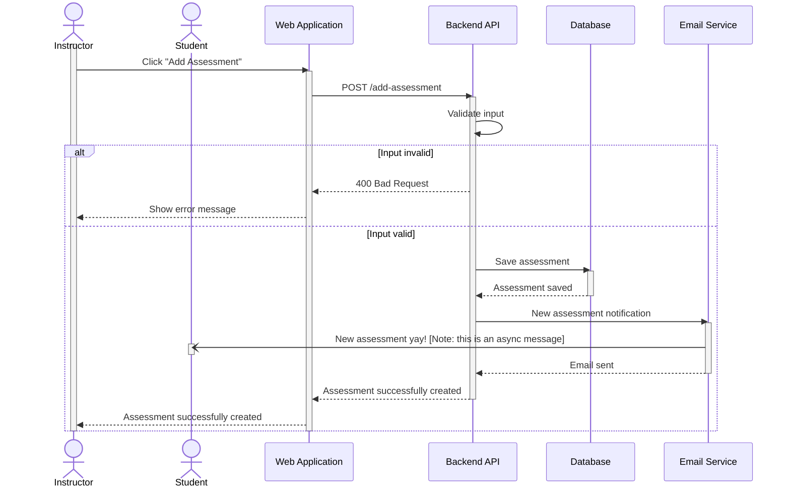

```mermaid
sequenceDiagram
    actor I as Instructor
    actor S as Student
    participant WA as Web Application
    participant BA as Backend API
    participant DB as Database
    participant ES as Email Service


    activate I
    I->>WA: Click "Add Assessment"
    activate WA

    WA->>BA: POST /add-assessment
    activate BA
    BA->>BA: Validate input

    alt Input invalid
        BA-->>WA: 400 Bad Request
        WA-->>I: Show error message
    else Input valid
        BA->>DB: Save assessment
        activate DB
        DB-->>BA: Assessment saved
        deactivate DB


        BA->>ES: New assessment notification
        activate ES


        ES-)S: New assessment yay! [Note: this is an async message]
        activate S
        deactivate S

        ES-->>BA: Email sent
        deactivate ES

        BA-->>WA: Assessment successfully created
        deactivate BA

        WA-->>I: Assessment successfully created
    end

    deactivate WA


    deactivate I
```